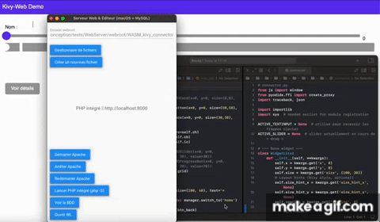

WebKivy

<!-- GIF + lien vers YouTube (rendu partout) -->
[](https://youtu.be/Ng7Pyy2f_kk)

youtube link : https://www.youtube.com/watch?v=Ng7Pyy2f_kk

WebKivy is a minimalist wrapper that allows you to run Kivy/KivyMD applications directly in a browser using Pyodide.

⸻

Summary
1. Why?
2. How it works
3. Quick Start
4. Repository Structure
5. Compatibility and Limitations
6. Roadmap
7. Contribute
8. License

⸻

Why?</br>
• No installation: Your Kivy app becomes a simple HTML + JS bundle.</br>
• Instant demo: Share a link or a .zip file, and the public can test it immediately.</br>
• Learning: Ideal for workshops or MOOCs where learners only have a browser at their disposal.

⸻

How it works</br>
1. Pyodide is loaded client-side (via a CDN).</br>   
2. The connector.py file reconstructs a subset of Kivy.</br>
• Base widgets: Label, Button, Slider, TextInput, ScreenManager, etc.</br>
• Lightweight KivyMD overlay: MDToolbar, MDRaisedButton, MDCard, etc.</br>
• HTML5 Canvas (<canvas id="kivy-canvas">) for 2D rendering.</br>
3. Your code imports these classes as if it were running the real library:</br>
from connector import BoxLayout, Label, Slider</br>
4. The JavaScript rendering loop calls the widgets' draw() method each frame, handles events (on_touch_down, keyboard, resize, etc.), and notifies the bindings (widget.bind(...)).

⸻

## Quick Start:</br>
```bash
git clone https://github.com/youraccount/WebKivy.git

cd webkivy/WASM_kivy_connector

#or

cd WebKivy/WASM_kivy_connector


# launches a small server – required for ES + Pyodide imports</br>
python3 -m http.server 8000
```


Open http://localhost:8000 then select/edit kivy_app.py to code your interface.</br>


# kivy_app.py</br>

```python
from connector import Button, BoxLayout, run_kivy_app
class HelloApp: # MDApp / App : no necessary
    def build(self):
        root = BoxLayout(orientation='vertical', size=(500,300))
        root.add_widget(Button(text="Click ?", on_press=lambda: print("Hello World !")))
        return root</br>

if __name__ == '__main__':
    run_kivy_app(__name__, 'HelloApp')
```

</br>
Save, refresh → your app is running in the browser!

⸻

## Repository structure:</br>

File / folder Role</br>
index.html Home page, loads main.js and prepares the <canvas></br>
main.js Initializes Pyodide, loads connector.py then kivy_app.py</br>
connector.py Kivy wrapper: stub widgets, layout, canvas, bindings, etc.</br>
kivy_app.py Your application; you're free to create several</br>
examples/ Recipes, KivyMD mini-demos, sliders, popups, ScreenManager, etc.</br>
assets/ Icons, test images, etc. (loaded via Image(source=...))

⸻

## Compatibility and Limitations:</br>

Feature Support Notes</br>
Basic Kivy Widgets ✓ Partial Position/Size: simplified x, y, size, size_hint</br>
Canvas (Line, Ellipse, etc.) ✓ Minimal Solid colors, no advanced transformations</br>
KivyMD ✓ Light Buttons, Toolbar, Card, Dialog, Checkbox, Slider, etc.</br>
Animations / Clock ✕ Not implemented (to be planned)</br>
Files / Storage ✕ No disk access: use localStorage, IPFS, etc.</br>
Multitouch / Gestures ✕ Mouse/single touch support only</br>
OpenGL / Shaders ✕ Incompatible with WebAssembly + Canvas2D

⸻

## Roadmap:</br>
• Clock.schedule_once / Animation support</br>
• Complex Widgets (Tab, RecycleView)</br>
• Automatic dark/light theme</br>
• WebSockets bridge to communicate with real Python backends</br>
• Offline generator (Pyodide bundle + app in a self-contained .html)</br>

⸻

## Contribute:</br>
1. Fork then git clone.</br>
2. Create a branch: git checkout -b feat/my-feature.</br>
3. Code; feel free to add an example in examples/.</br>
4. Open a Pull Request</br>
</br>
Thanks!</br>
</br>
Bugs? Open an Issue with a minimal, reproducible script + console capture.
